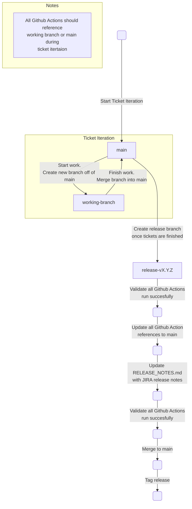

# Release Workflow

This document will detail the release process for this repository.

```mermaid
flowchart TB

start( )
main[main]
working_branch[working-branch]
release_branch[release-vX.Y.Z]

start --"Start Ticket Iteration"-----> main 
main --"Start work.\nCreate new branch off of main"--> working_branch 
working_branch --"Finish work.\nMerge branch into main"--> main
subgraph ticket_iteration[Ticket Iteration]
main
    working_branch
end

subgraph notes[Notes]
    note_1[All Github Actions should reference\nworking branch or main during\nticket itertaion]
end

main --"Create release branch\nonce tickets are finished"----> release_branch
release_branch --"Validate all Github Actions\nrun succesfully"--> empty_1( )
empty_1 --"Update all Github Action\nreferences to main"--> empty_2( )
empty_2 --"Update RELEASE_NOTES.md\nwith JIRA release notes"--> empty_3( )
empty_3 --"Validate all Github Actions\nrun succesfully"--> empty_4( )
empty_4 --"Merge to main"--> empty_5( )
empty_5 --"Tag release"--> empty_6( )

```
