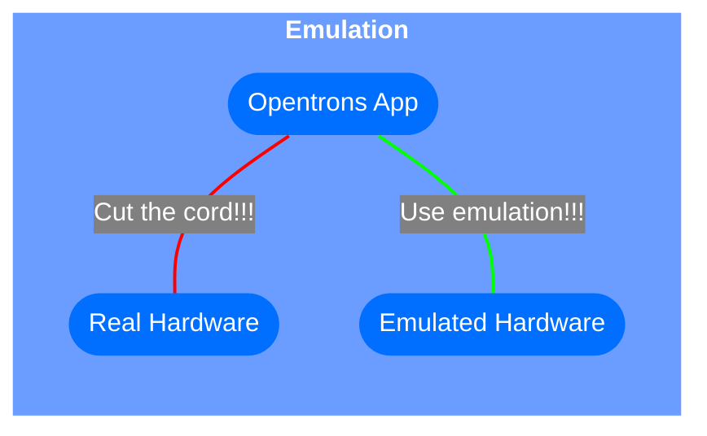

# Opentrons Emulation

[](https://vscode.dev/redirect?url=vscode://ms-vscode-remote.remote-containers/cloneInVolume?url=https://github.com/Opentrons/opentrons-emulation)


Opentrons has various software emulations of their hardware. This repository defines a framework to dynamically connect
all these emulators together into systems.

- [BREAKING CHANGES](#breaking-changes)
  - [Upgrading from v2 to v3](#upgrading-from-v2-to-v3)
- [What is an Emulator?](#what-is-an-emulator-)
- [How do the Opentrons Emulators work?](#how-do-the-opentrons-emulators-work-)
- [Supported Hardware](#supported-hardware)
- [Development Container (devcontainer)](#development-container--devcontainer-)
  - [Fastest path to ot2 or ot3 emulation](#fastest-path-to-ot2-or-ot3-emulation)
    - [Still building...](#still-building)
    - [Done!](#done-)
    - [Video of the preceding 6 steps](#video-of-the-preceding-6-steps)
    - [Connect the Opentrons app](#connect-the-opentrons-app)

* [Local setup](#local-setup)
  - [Required Software](#required-software)
    - [Docker](#docker)
    - [Docker-Compose](#docker-compose)
    - [Poetry](#poetry)
    - [Pyenv and Python](#pyenv-and-python)
  - [Initial Configuration](#initial-configuration)
  - [Quick Setup](#quick-setup)
    - [OT2 With All Modules](#ot2-with-all-modules)
    - [OT3](#ot3)
  - [Makefile Commands](#makefile-commands)
  - [Building Your Own Configuration Files](#building-your-own-configuration-files)
  - [Setting Up For Local Development](#setting-up-for-local-development)
    - [CPX Setup](#cpx-setup)
    - [OT3 Firmware Development Setup](#ot3-firmware-development-setup)
    - [Apps and UI Setup](#apps-and-ui-setup)
  - [Architecture Diagrams](#architecture-diagrams)
  - [Github Action](#github-action)
  - [How To Modify Dockerfiles](#how-to-modify-dockerfiles)
* [Debugging](#debugging)
  - [Debugging Docker-Compose File Generation](#debugging-docker-compose-file-generation)



## BREAKING CHANGES

Any breaking changes will be listed here.

### Upgrading from v2 to v3

Any `robot` block with a `hardware` value of `ot3` now **_REQUIRES_** that `opentrons-hardware-source-type` and
`opentrons-hardware-source-location` be defined.
See [docs](https://github.com/Opentrons/opentrons-emulation/blob/release-v3.0.0/docs/EMULATION_CONFIGURATION_FILE_KEY_DEFINITIONS.md#ot3-specific-parameters)
and [examples](https://github.com/Opentrons/opentrons-emulation/tree/release-v3.0.0/samples/ot3)

## What is an Emulator?

The simplest description of an emulator is: a software model that stands in for a piece of hardware.

In practice, this software model should behave and respond the same way as the hardware being replaced. The
software that is connected to the emulator should not know the difference between an emulator and the actual hardware.
It should interact with the emulator in exactly the same manner that it interacts with the hardware.

## How do the Opentrons Emulators work?

The Opentrons emulators are implemented in one of two ways:

1. Emulating at the firmware level
1. Emulating at the hardware level.

Firmware Emulation replaces the firmware with a software model and the drivers interact with the model. Note that at
this level, the hardware is also theoretically emulated as well.

Hardware Emulation replaces the hardware itself with a software model and the firmware interacts with the model.

Each piece of hardware you emulate in your system will require you to specify whether you are using `firmware` level
emulation or `hardware` level emulation. See [emulation-level](#emulation-level) for a mapping of hardware to emulation
level.

## Supported Hardware

The following hardware is supported:

- OT2
- OT3
- Thermocycler Module
- Temperature Module
- Magnetic Module
- Heater Shaker Module

**Note: Since we are building from source code the hardware is whatever version the source is. Generally, this means the
latest version. Unless you load a really old version, but no guarantees that a super old version will actually work.**

## Development Container (devcontainer)

A [devcontainer](https://containers.dev/) specification is provided and cached for this repository.

### Fastest path to ot2 or ot3 emulation

> These steps will provide an emulator running code from the default branches of the underlying repositories.

1. [Install Docker](#docker)
1. [Install Visual Studio Code (VSCode)](https://code.visualstudio.com/Download)
1.

Click [](https://vscode.dev/redirect?url=vscode://ms-vscode-remote.remote-containers/cloneInVolume?url=https://github.com/Opentrons/opentrons-emulation)

> It will take some minutes to build the devcontainer. Click the `Starting Dev Container (show log)` alert at the bottom
> right to watch the progress.

#### Still building...


#### Done!


1. Open the terminal
1. Enter the command `make ot2` or `make ot3`
1. Wait until the emulator is up
1. Open a new terminal
1. Enter the command `make check-robot` to validate the robot is reachable
1. To shut down the emulated robot go back to the terminal where you entered  `make ot2` or `make ot3`
   1. Click where logs are scrolling and press `ctrl` and `c` at the same time.

#### Video of the preceding 6 steps

<video src="https://user-images.githubusercontent.com/502770/194157913-316e8115-2ff4-4658-a274-8b22f2bdef5c.mp4" data-canonical-src="https://user-images.githubusercontent.com/502770/194157913-316e8115-2ff4-4658-a274-8b22f2bdef5c.mp4" controls="controls" muted="muted" class="d-block rounded-bottom-2 border-top width-fit" style="max-height:640px;">
</video>

#### Connect the Opentrons app

1. Open your Opentrons app and have it look for the robot on `localhost`

<video src="https://user-images.githubusercontent.com/502770/194162290-48c370f9-2b1b-4a75-995b-d6f1dc2e39bb.mp4" data-canonical-src="https://user-images.githubusercontent.com/502770/194162290-48c370f9-2b1b-4a75-995b-d6f1dc2e39bb.mp4" controls="controls" muted="muted" class="d-block rounded-bottom-2 border-top width-fit" style="max-height:640px;"></video>

> The devcontainer makes local setup unnecessary except for developers doing complex changes to this repository or
> needing to inject on disk code.

# Local setup

## Required Software

Install the following software:

### Docker

1. [Mac Instructions](https://docs.docker.com/desktop/mac/install/)
   1. Make sure that you have rosetta installed if you are running on an M1 Mac, `softwareupdate --install-rosetta`
1. [Linux Instructions](https://docs.docker.com/engine/install/#server)

### Docker-Compose

1. Mac Instructions: Installed when you install Docker
1. [Linux Instructions](https://docs.docker.com/compose/install/)

### Poetry

1. [Poetry Installed Globally](https://python-poetry.org/docs/master/#installing-with-the-official-installer)
   1. Run `curl -sSL https://install.python-poetry.org | python3 -`

### Pyenv and Python

<details>
   <summary>Click To Expand Detailed Instructions</summary>

**Setup (Mac)**

1. Install [pyenv](https://github.com/pyenv/pyenv) using brew

```
brew update
brew install pyenv
```

2. Configure your shell env

```
echo 'eval "$(pyenv init --path)"' >> ~/.zprofile
echo 'eval "$(pyenv init -)"' >> ~/.zshrc
```

3. Restart your terminal
   1. Install Python Build Dependencies

```
brew install openssl readline sqlite3 xz zlib
```

5. Pyenv is now ready to use

**Setup (Linux)**

1. Checkout [pyenv](https://github.com/pyenv/pyenv)
   ```
   git clone https://github.com/pyenv/pyenv.git ~/.pyenv
   ```
   1. Configure your shell env
      ```
       sed -Ei -e '/^([^#]|$)/ {a \
       export PYENV_ROOT="$HOME/.pyenv"`
       a \
       export PATH="$PYENV_ROOT/bin:$PATH"
       a \
       ' -e ':a' -e '$!{n;ba};}' ~/.profile
       echo 'eval "$(pyenv init --path)"' >>~/.profile
       echo 'eval "$(pyenv init -)"' >> ~/.bashrc`
      ```
   1. Restart your terminal
   1. Install Python Build Dependencies
      ```
      sudo apt-get update
      sudo apt-get install \
      make \
      build-essential \
      libssl-dev \
      zlib1g-dev \
      libbz2-dev \
      libreadline-dev \
      libsqlite3-dev \
      wget \
      curl \
      llvm \
      libncursesw5-dev \
      xz-utils \
      tk-dev \
      libxml2-dev \
      libxmlsec1-dev \
      libffi-dev \
      liblzma-dev
      ```
   1. Pyenv is now ready to use

**Installing Python**

1. Run `pyenv install --list` to get a list of all available Python versions.
   1. Choose the latest 3.10 version. For the purpose of this document we will say the latest version is `3.10.4`
   1. Run `pyenv install 3.10.4` to install Python
   1. Run `pyenv global 3.10.4`  to set the system version to 3.10.4
   1. Verify that you are running the correct Python version by running `pyenv version`
      1. It should say `3.10.4` (set by /something/something/something/pyenv/version)

**Troubleshooting**

_Problem_

When trying to run `pyenv install 3.10.x` you get

```bash
✘ Failed... Something went wrong... python-build: definition not found: 3.10.4
```

_Soulution_

You need to update pyenv. Follow [these](https://github.com/pyenv/pyenv#upgrading) instructions. Then try again.

</details>

## Initial Configuration

1. In the root of the repository, create to `configuration.json` from `configuration_sample.json`
   1. `cp configuration_sample.json configuration.json`
1. You can leave everything default.
   1. TODO: `global-settings`, `virtual-machine-settings`, and `aws-ecr-settings` will be removed in future releases
1. Run `make setup`

## Quick Setup

Now you have performed the initial configuration lets get an emulated system running.

### OT2 With All Modules

An OT2 with a Heater-Shaker Module, Temperature Module, Thermocycler Module, and a Magnetic Module

> Run the following commands from the root of the repo.

**Build the Docker Images**

```bash
make build file_path=samples/ot2/ot2_with_all_modules.yaml
```

**Start the Emulator**

```bash
make run-detached file_path=samples/ot2/ot2_with_all_modules.yaml
```

**Verify Emulation is Working**

Running the following curl command will hit the /modules endpoint. It should return a JSON describing the attached
modules.

> This is available by running `make emulation-check`

```bash
curl -s --location --request GET 'http://localhost:31950/modules' --header 'opentrons-version: *' | json_pp -json_opt pretty,canonical
```

**Remove Emulation**

```bash
make generate-compose-file file_path=samples/ot2/ot2_with_all_modules.yaml
make remove file_path=samples/ot2/ot2_with_all_modules.yaml
```

### OT3

An OT3

> Run the following commands from the root of the repo.

**Build the Docker Images**

```bash
make build file_path=samples/ot3/ot3_remote.yaml
```

**Start the Emulator**

```bash
make run-detached file_path=samples/ot3/ot3_remote.yaml
```

**Verify Emulation is Working**

Open a CAN bus monitor in another terminal

```bash
make can-mon file_path=samples/ot3/ot3_remote.yaml
```

**Video Walkthrough for Mac / Linux setup**

[Video from Derek Maggio on setting up the emulator](https://drive.google.com/file/d/1ftq5MsOYZJY2gy9aGKYvK86O_9n6HZ4w/view)

## Makefile Commands

Go to [MAKEFILE_COMMANDS.md](https://github.com/Opentrons/opentrons-emulation/blob/main/docs/MAKEFILE_COMMANDS.md)

## Building Your Own Configuration Files

To run an emulated system you need to create an emulation system configuration file. This can either be a JSON file or a
YAML file. You can create a single robot and unlimited number of modules in a single configuration, although neither are
required.

The `samples` directory contains samples of YAML configurations.

If you want to create you own files go
to [EMULATION_CONFIGURATION_FILE_KEY_DEFINITIONS.md](https://github.com/Opentrons/opentrons-emulation/blob/main/docs/EMULATION_CONFIGURATION_FILE_KEY_DEFINITIONS.md)
for definitions of all the options and examples of more complex setups.

## Setting Up For Local Development

### CPX Setup

Go to [CPX_SETUP.md](https://github.com/Opentrons/opentrons-emulation/blob/main/docs/team_specific_setup/CPX_SETUP.md)

### OT3 Firmware Development Setup

Go
to [OT3_FIRMWARE_DEVELOPMENT_SETUP.md](https://github.com/Opentrons/opentrons-emulation/blob/main/docs/team_specific_setup/OT3_FIRMWARE_DEVELOPMENT_SETUP.md)

### Apps and UI Setup

Go
to [APPS_AND_UI_SETUP.md](https://github.com/Opentrons/opentrons-emulation/blob/main/docs/team_specific_setup/APPS_AND_UI_SETUP.md)

## Architecture Diagrams

For more information on how containers are connected to one another and how they communicated refer to
[ARCHITECTURE.md](https://github.com/Opentrons/opentrons-emulation/blob/main/docs/ARCHITECTURE.md)

For information on the Docker build process refer
to [DOCKERFILE_ARCHITECTURE.md](https://github.com/Opentrons/opentrons-emulation/blob/main/docs/DOCKERFILE_ARCHITECTURE.md)

## Github Action

For information on this repository's Github Action refer
to [GITHUB_ACTION_DOCS.md](https://github.com/Opentrons/opentrons-emulation/blob/main/docs/GITHUB_ACTION_DOCS.md)

## How To Modify Dockerfiles

`opentrons-emulation` is split up into 2 Dockerfiles: `bases_Dockerfile` and `Dockerfile`.

Images in `bases_Dockerfile` are cached to [Github Packages](https://github.com/features/packages) to reduce build time.

`Dockerfile` pulls these pre-built images down from Github Packages instead of building them from scratch.

The issue comes in when testing your changes to `bases_Dockerfile`.

Because `Dockerfile` is hardcoded to pull images
from Github Packages, you can't really test your changes to `bases_Dockerfile` without pushing your changes and pulling
them back down. Well if you push broken changes then you break everything for everyone and then everyone hates you.

In order to avoid the wrath of the entire Opentrons software team, the solution is to use the Makefile commands
prefixed with `dev-`. These commands will combine the 2 Dockerfiles into a single local
development Dockerfile and you can test building and running locally.

An example dev workflow is as follows.

1. Make some changes to `bases_Dockerfile`
1. Run `make dev-build file_path=./samples/your/path && make dev-run file_path=./samples/your/path`
1. Test your changes

# Debugging

## Debugging Docker-Compose File Generation

The generation of the docker-compose file is complex. Business logic is built into the code.
Two log files are generated for any command that calls `generate-compose-file` so that the logic may be audited.

There are two versions of the log file:

- **Raw Text File:** `opentrons-emulation/compose_file_creator_log.txt`
- **Rich Text File:** `opentrons-emulation/compose_file_creator_log.html`

The `.txt` file may be viewed in any text editor. The `.html` file may be viewed in a text editor that supports html
rendering or in a browser.
