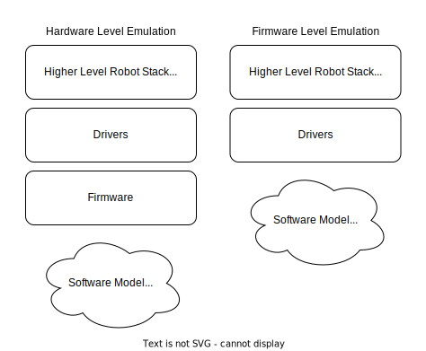

# Opentrons Emulation

Opentrons has various software emulations of their hardware. This repository defines a framework to dynamically connect
all these emulators together into systems.

- [What is an Emulator?](#what-is-an-emulator-)
- [Supported Hardware](#supported-hardware)
- [Required Software](#required-software)
- [Initial Configuration](#initial-configuration)
- [Using Emulation](#using-emulation)
    * [Emulation Commands](#emulation-commands)
        + [Building System](#building-system)
        + [Running System](#running-system)
        + [Viewing System Logs](#viewing-system-logs)
        + [Removing System](#removing-system)
        + [Generate Compose File](#generate-compose-file)
- [Emulation Configuration File Key Definitions](#emulation-configuration-file-key-definitions)
    * [id](#id)
    * [system-unique-id](#system-unique-id)
    * [hardware](#hardware)
    * [source-type](#source-type)
    * [source-location](#source-location)
    * [emulation-level](#emulation-level)
    * [exposed-port](#exposed-port)
    * [hardware-specific-attributes](#hardware-specific-attributes)
        + [Pipettes](#pipettes)
            - [Available Pipette Models:](#available-pipette-models-)
        + [Heater-Shaker and Thermocycler Refresh Communication Mode](#heater-shaker-and-thermocycler-refresh-communication-mode)
        + [Temperature Model for Thermocycler and Temperature Modules](#temperature-model-for-thermocycler-and-temperature-modules)

## What is an Emulator?

The simplest description is an emulator is a software model that stands in for a piece of hardware.

In practice, this software model should behave and respond the same way as the hardware it is standing in for. The
software that is connected to the emulator should not know the difference between an emulator and the actual hardware.
It should interact with the emulator in exactly the same manner that it interacts with the hardware.

## How do the Opentrons Emulators work?

The Opentrons emulators are implemented in one of two ways: by emulating at the firmware level or the hardware level.

Firmware Emulation replaces the firmware with a software model and the drivers interact with the model. Note that at
this level, the hardware is also theoretically emulated as well.

Hardware Emulation replaces the hardware itself with a software model and the firmware interacts with the model.

Each piece of hardware you emulate in your system will require you to specify whether you are using `firmware` level
emulation or `hardware` level emulation. See [emulation-level](#emulation-level) for a mapping of hardware to emulation
level.

## Supported Hardware

The following hardware is supported:

- OT2
- OT3
- Thermocycler Module
- Temperature Module
- Magnetic Module
- Heater Shaker Module

**Note: Since we are building from source code the hardware is whatever version the source is. Generally, this means the
latest version. Unless you load a really old version, but no guarantees that a super old version will actually work.**

## Required Software

Install the following software:

1. Docker
    1. [Mac Instructions](https://docs.docker.com/desktop/mac/install/)
    2. [Linux Instructions](https://docs.docker.com/engine/install/#server)
2. Docker-Compose
    1. Mac Instructions: Installed when you install Docker
    2. [Linux Instructions](https://docs.docker.com/compose/install/)
3. [Install Python 3](https://www.python.org/downloads/)

## Initial Configuration

1. In the root of the repository, copy and paste `configuration_sample.json` to `configuration.json`
2. You can leave everything default.
    1. TODO: `global-settings`, `virtual-machine-settings`, and `aws-ecr-settings` will be removed in future releases
3. Run `make setup`

## Using Emulation

To run an emulated system you need to create an emulation system configuration file. This can either be a JSON file or a
YAML file. You can create a single robot and unlimited number of modules in a single configuration, although neither are
required.

The `samples` directory contains samples of both JSON and YAML configurations.

Once you have a configuration file together you can utilize the various Make commands to build, run, view the logs of,
and remove systems.

### Emulation Commands

The following emulation commands require a `file_path` argument with a path to a valid emulation configuration file. Can
use environment variables like `PWD` for building paths. They are executed in the top-level directory of the repository.

#### Building System

**Description:** Use this command to build the necessary Docker images from your system. Docker images should be rebuilt
under the following conditions:

- If anything changes in your configuration file
- If you have an emulator using `remote` source type, `latest` source location, and there has been an update to the main
  branch of the source repo
- If the underlying Dockerfile changes

**Command:** `em-build-amd64` OR `em-build-arm64`

Use `em-build-amd64` if you are on an Intel based processor.

Use `em-build-arm64` if you are on a Mac M1 processor.

**Example:** `make em-build-amd64 file_path=${PWD}/samples/yaml/ot2.yaml`

#### Running System

**Description:** Use this command to bring up an emulated system.

**Command:** `make em-run file_path=${PWD}/samples/yaml/ot2.yaml`

#### Viewing System Logs

**Description:** Use this command view the logs of a running emulation system.

**Command:** `make em-logs file_path=${PWD}/samples/yaml/ot2.yaml`

#### Removing System

**Description:** Use this command to remove an emulated system.

**Command:** `make em-remove file_path=${PWD}/samples/yaml/ot2.yaml`

#### Generate Compose File

**Description:** Use this command to generate the Docker Compose file that the system runs under the hood.

**Command:** `make generate-compose-file file_path=${PWD}/samples/yaml/ot2.yaml`

## Emulation Configuration File Key Definitions

The following definitions are available for usage in the emulation configuration file.
`Configuration File Alias` is the value that needs to be put in the configuration file

### id

**Description:** A string value for the name of the emulator.

**Acceptable Values:** Can consist of alphanumeric characters and dashes.

**Examples:** `a-name-for-a-container` `s0me-other-name`

### system-unique-id

**Description:** A string value that will be prefixed to all emulator and network names. Use this to differentiate
systems with the same configuration.

**Acceptable Values:** Can consist of alphanumeric characters and dashes.

**Example:**

You are testing 2 different versions of Heater-Shaker firmware. So you want 2 systems, each with an OT2 and a
Heater-Shaker, with ids `otie` and `twitchy` respectively. The first system can have a `system-unique-id` of
`system-1` and the second system can be `system-2`. The ids of system 1 will be `system-1-otie` and `system-1-twitchy`.
The ids of system 2 will be `system-2-otie` and `system-2-twitchy`.

Because of the `system-unique-id` the emulator names do not clash.

### hardware

**Description:** A string value specifying which hardware to create.

**Acceptable Values:** `ot2`, `ot3`, `heater-shaker-module`, `thermocycler-module`, `temperature-module`,
`magnetic-module`

### source-type

**Description:** A string value specifying where to pull source code from to build the emulator. You can either pull
committed code from Github, or bind in your own local code.

**Acceptable Values:** `remote` `local`

### source-location

**Description:** A string value specifying where the system should look for the source code based on the `source-type`.

If you are using `remote` type, you can either specify `latest` to pull the latest committed version from the master
branch, or specify a full commit sha to pull.

If you are using `local` type, specify a path to the source on your system.

### emulation-level

**Description:** A string value specifiying which emulation level should be used.

**Acceptable Values:** `firmware` `hardware`



**Supported Emulation Levels By Hardware:**

The various emulators in this repository support different levels of emulation based on their architecture. Below is a
table with the supported levels for each emulator.

| Hardware                 | Firmware Emulation | Hardware Emulation         |
|--------------------------|--------------------|----------------------------|
| **OT2**                  | Yes                | No                         |
| **OT3**                  | No                 | Yes                        |
| **Heater-Shaker Module** | No                 | Yes                        |
| **Thermocycler Module**  | Yes                | Yes (Thermocycler Refresh) |
| **Magnetic Module**      | Yes                | No                         |
| **Temperature Module**   | Yes                | No                         |

### exposed-port

**Description:** An integer value specifying a port to expose to the host system. This is currently only available for
ot2 and ot3 hardware.

**Acceptable Values:** Any free port number

### hardware-specific-attributes

**Description:** An object containing any specific configuration values for hardware you are using.

**Acceptable Values:** Varies. Breakdown below.

#### Pipettes

For OT2 and OT3 you can configure the pipettes attached to the emulated robot.

Example: An OT2 with a P1000 Single and P300 Multi

```json
{
    "system-unique-id": "ot2-only",
    "robot": {
        "id": "otie",
        "hardware": "ot2",
        "source-type": "remote",
        "source-location": "latest",
        "emulation-level": "firmware",
        "exposed-port": 31950,
        "hardware-specific-attributes": {
            "left-pipette": {
                "model": "p1000_single_v2.2",
                "id": "somerandomid"
            },
            "right-pipette": {
                "model": "p300_multi_v2.1",
                "id": "someotherrandomid"
            }
        }
    }
}
```

----

##### Available Pipette Models:

**Version 1 Pipette Models**

**P10 Single V1:**
`p10_single_v1` `p10_single_v1.3` `p10_single_v1.4` `p10_single_v1.5`

**P10 Multi V1:**
`p10_multi_v1` `p10_multi_v1.3` `p10_multi_v1.4` `p10_multi_v1.5` `p10_multi_v1.6`

**P50 Single V1:**
`p50_single_v1` `p50_single_v1.3` `p50_single_v1.4` `p50_single_v1.5`

**P50 Single V1:**
`p50_multi_v1` `p50_multi_v1.3` `p50_multi_v1.4` `p50_multi_v1.5`

**P300 Single V1:**
`p300_single_v1` `p300_single_v1.3` `p300_single_v1.4` `p300_single_v1.5`

**P300 Multi V1:**
`p300_multi_v1` `p300_multi_v1.3` `p300_multi_v1.4` `p300_multi_v1.5`

----

**Version 2 Pipette Models**

**P20 Single V2:**
`p20_single_v2.0` `p20_single_v2.1` `p20_single_v2.2`

**P20 Single V2:**
`p20_multi_v2.0` `p20_multi_v2.1`

**P300 Single V2:**
`p300_single_v2.0` `p300_single_v2.1`

**P300 Multi V2:**
`p300_multi_v2.0` `p300_multi_v2.1`

**P1000 Single V1:**
`p1000_single_v1` `p1000_single_v1.3` `p1000_single_v1.4` `p1000_single_v1.5`

**P1000 Single V2:**
`p1000_single_v2.0` `p1000_single_v2.1` `p1000_single_v2.2`

----

**Version 3 Pipette Models**

**P1000 Single V3:**
`p20_single_v3.0` `p300_single_v3.0` `p1000_single_v3.0`

----

#### Heater-Shaker and Thermocycler Refresh Communication Mode

For Heater-Shaker and Thermocycler Refresh you can specify the communication mode for the firmware. Either socket or
through typing G-Codes through stdin. Stdin mode is really only useful for the lowest level debugging and for debugging
the module by itself with nothing else attached. Therefore, it is defaulted to socket mode.

Example: Heater-Shaker in Stdin mode

```json
{
    "system-unique-id": "heater-shaker-stdin-debug",
    "modules": [
        {
            "id": "shakey-and-warm",
            "hardware": "heater-shaker-module",
            "source-type": "remote",
            "source-location": "latest",
            "emulation_level": "hardware",
            "hardware-specific-attributes": {
                "mode": "stdin"
            }
        }
    ]
}
```

#### Temperature Model for Thermocycler and Temperature Modules

For the Thermocycler and Temperature modules you can specify the starting temperature and temperature ramp rate
(degrees-per-tick).

Example 1: Thermocycler Module with custom temperature model

```json
{
    "system-unique-id": "thermocycler-with-custom-temperature-model",
    "modules": [
        {
            "id": "t00-hot-to-handle",
            "hardware": "thermocycler-module",
            "source-type": "remote",
            "source-location": "latest",
            "emulation_level": "firmware",
            "hardware-specific-attributes": {
                "lid-temperature": {
                    "starting": 27.0,
                    "degrees-per-tick": 2.3
                },
                "plate-temperature": {
                    "starting": 23.0,
                    "degrees-per-tick": 3.2
                }
            }
        }
    ]
}
```

Example 2: Temperature Module with custom temperature model

```json
{
    "system-unique-id": "temperature-module-with-custom-temperature-model",
    "modules": [
        {
            "id": "temperamental",
            "hardware": "temperature-module",
            "source-type": "remote",
            "source-location": "latest",
            "emulation_level": "firmware",
            "hardware-specific-attributes": {
                "temperature": {
                    "starting": 27.0,
                    "degrees-per-tick": 2.3
                }
            }
        }
    ]
}
```
