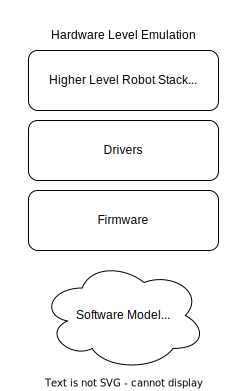

# Opentrons Emulation

Framework to set up emulated Opentrons hardware. Uses Docker and Docker-Compose to create systems in which either the
firmware or hardware is emulated with software.

## Supported Hardware

The following hardware is supported:

- OT2
- OT3
- Thermocycler Module
- Temperature Module
- Magnetic Module
- Heater Shaker Module

## Getting Started

### Required Software

Install the following software:

1. Docker
    1. [Mac Instructions](https://docs.docker.com/desktop/mac/install/)
    2. [Linux Instructions](https://docs.docker.com/engine/install/#server)
2. Docker-Compose
    1. Mac Instructions: Installed when you install Docker
    2. [Linux Instructions](https://docs.docker.com/compose/install/)
3. [Install Python 3](https://www.python.org/downloads/)

## Initial Configuration

1. In the root of the directory, copy and paste `configuration_sample.json` to `configuration.json`
2. You can leave everything default.
    1. TODO: `global-settings`, `virtual-machine-settings`, and `aws-ecr-settings` will be removed in future releases
3. Run `make setup`

## Using Emulation

To run an emulated system you need to create an emulation system configuration file. This can either be a JSON file or a
YAML file. You can create a single robot and unlimited number of modules in a single configuration, although neither are
required.

The `samples` directory contains samples of both JSON and YAML configurations.

### Getting started

To get started, pick out what hardware you want to use. You can choose any combination of available hardware that you
want. The only constraint is that you can choose only 1 robot.

Once you know the hardware that you want, you will need to figure out what emulation level you want for each.

## Emulation Configuration File Key Definitions

The following definitions are available for usage in the emulation configuration file.
`Configuration File Alias` is the value that needs to be put in the configuration file

### ID

**Description:** A string value for the name of the emulator.

**Configuration File Alias:** `id`

**Acceptable Values:** Can consist of alphanumeric characters and dashes.

**Examples:** `a-name-for-a-container` `s0me-other-name`

### System Unique ID

**Description:** A string value that will be prefixed to all emulator and network names. Use this to differentiate
systems with the same configuration.

**Configuration File Alias:** `system-unique-id`

**Acceptable Values:** Can consist of alphanumeric characters and dashes.

#### Example:

You are testing 2 different versions of Heater-Shaker firmware. So you want 2 systems, each with an OT2 and a
Heater-Shaker with ids `otie` and `twitchy` respectively. The first system can have a `system-unique-id` of
`system-1` and the second system can be `system-2`. The ids of system 1 will be `system-1-otie` and `system-1-twitchy`.
The ids of system 2 will be `system-2-otie` and `system-2-twitchy`.

Because of the `system-unique-id` the emulator names do not clash.

### Hardware

**Configuration File Alias:** `hardware`

### Source Type

**Configuration File Alias:** `source-type`

### Source Location

**Configuration File Alias:** `source-location`

### Emulation Level

**Description:** Emulation level is the point in tech stack that is abstracted away by a software model. There are 2
types of emulation levels: `Firmware Emulation` and `Hardware Emulation`.

Firmware Emulation replaces the firmware with a software model and the drivers interact with the model.

Hardware Emulation replaces the hardware with a software model and the firmware interacts with the model.

**Configuration File Alias:** `emulation-level`

**Acceptable Values:** `firmware` `hardware`

**Supported Emulation Levels By Hardware:**

Below is a table with the available levels for each piece of hardware.

| Hardware                 | Firmware Emulation | Hardware Emulation         |
|--------------------------|--------------------|----------------------------|
| **OT2**                  | Yes                | No                         |
| **OT3**                  | No                 | Yes                        |
| **Heater-Shaker Module** | No                 | Yes                        |
| **Thermocycler Module**  | Yes                | Yes (Thermocycler Refresh) |
| **Magnetic Module**      | Yes                | No                         |
| **Temperature Module**   | Yes                | No                         |

### Exposed Port

**Configuration File Alias:** `exposed-port`

### Hardware Specific Attributes

**Configuration File Alias:** `hardware-specific-attributes`
