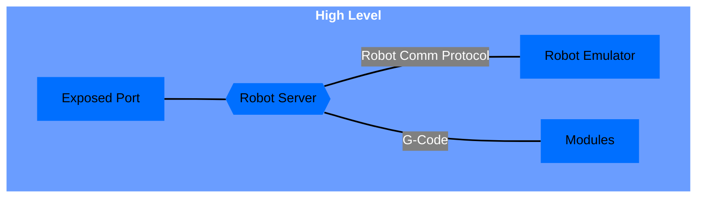
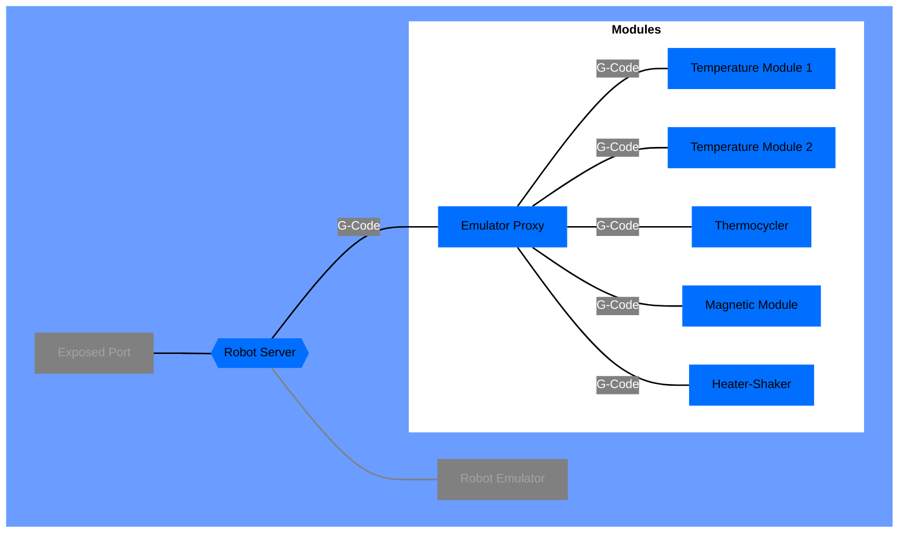
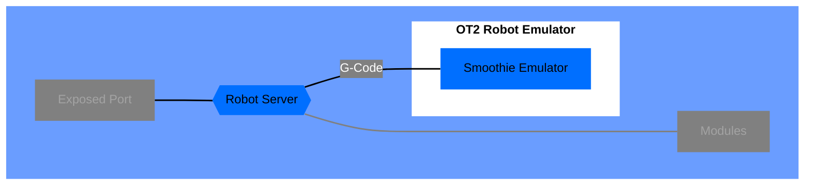
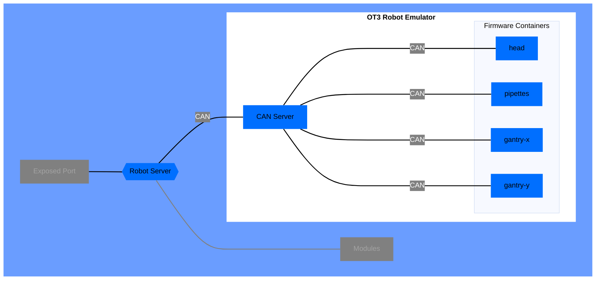
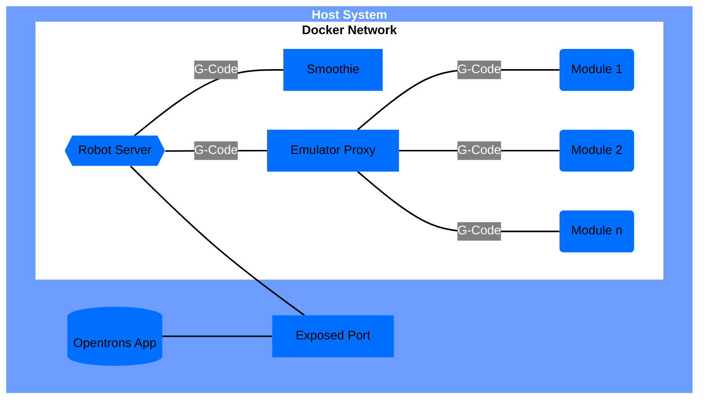
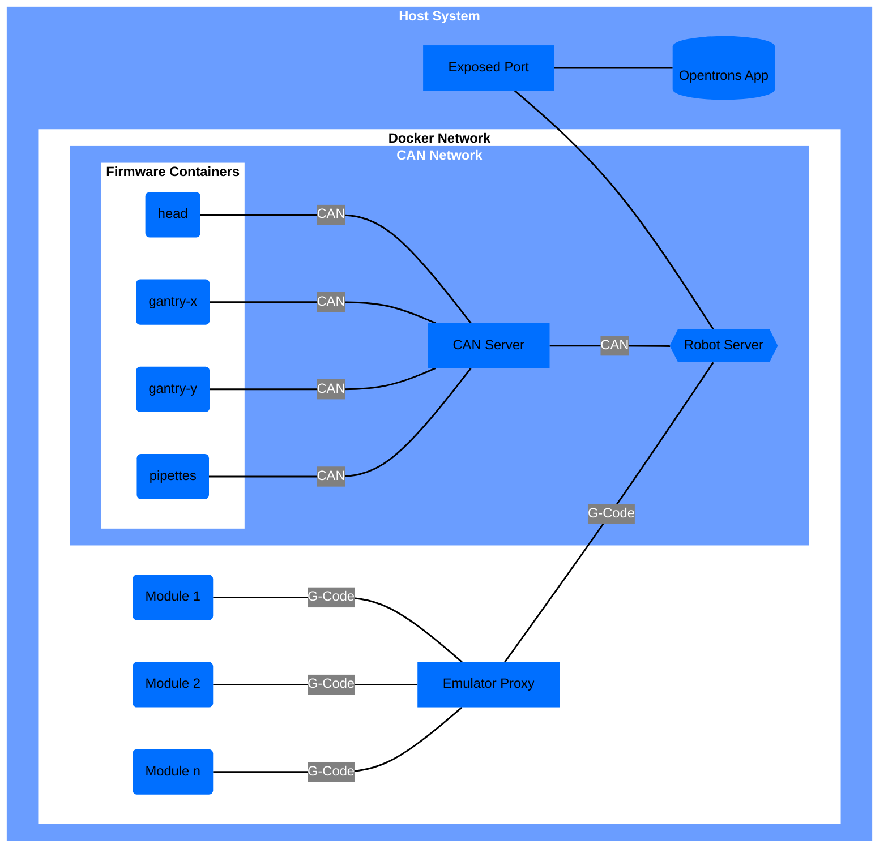

# Docker Architecture

This document will start by detailing how `opentrons-emulation` is architected using Docker from a high-level. As it
goes further on, it will attempt to clarify some of the more complicated aspects of the Docker architecture.

## Emulation Architecture

`opentrons-emulation` supports emulating an Opentrons robot and it's modules.

At the highest level an emulated system can be broken up into 4 distinct pieces: an `Exposed Port`, a `Robot Server`,
all the emulated `Modules`, and a `Robot Emulator`.

### Exposed Port

The exposed port is the connection point from external services to the emulated system.

### Robot Server

The `Robot Server` is a container running
the [robot-server](https://github.com/Opentrons/opentrons/tree/edge/robot-server)
project using [uvicorn](https://www.uvicorn.org/).

### Modules

The `Modules` piece of emulation are containers running emulated Opentrons Modules. These containers are emulations of
the various Opentrons Modules: Heater-Shaker Module, Thermocyler Module, Temperature Module, Magnetic Module.

While you can technically specify an infinite number of modules. In practice, you should limit the number of your
modules to what could actually fit on a deck. In the diagram the Modules are designated as `Module 1`, `Module 2`
and `Module n`.

#### Emulator Proxy

The Robot Server connects to the modules through the Emulator Proxy.

The Emulator Proxy handles all communication from the modules and sends it on to the Robot Server.

### Robot Emulators

The `Robot Server` must connect to a `Robot Emulator` that emulates the functionality of the Opentrons robots. Currently
there are 2 supported robots: OT2 and OT3.

You select which emulator to use by setting the `hardware` property of the `robot` element to `ot2` or `ot3`
respectively.

#### OT2 Robot Emulator

The OT2 Robot Emulator is a single container running a `Smoothie` Emulator and communicates using the G-Code protocol.

#### OT3 Robot Emulator

The OT3 Robot Emulator is a group of containers running all the ot3-firmware firmware emulators.

Currently, they consist of: `head`, `gantry-x`, `gantry-y`, and `pipettetes`. Between the Robot Server and firmware
containers sits the `CAN Server`. The CAN Server handles dispatching of messages to and from the firmware containers.

## Full System Diagrams

The below diagrams are the fully exploded diagrams showing all the containers and connections in an OT2 and OT3 emulated
system.

### OT2

### OT3

