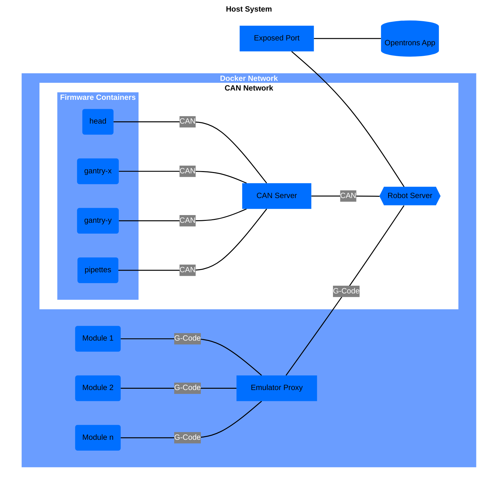

# Architecture

## OT3 Docker Architecture

The below diagram depicts how an emulated OT3 is set up on a system.

It begins with a `Robot Server` emulator which has a port exposed to the host system, allowing for interfacing to
outside applications, namely the Opentrons App.

From there we have 2 groups of emulators: `Modules` and `OT3 Firmware`.

The first group is Opentrons Modules. These modules are emulations of the Opentrons Modules: Heater-Shaker Module,
Thermocyler Module, Temperature Module, Magnetic Module.

You can technically specify an infinite number of modules. In practice, you should limit the number of your modules to
what could actually fit on a deck. In the diagram the Modules are designated as `Module 1`, `Module 2` and `Module n`.

The second group of emulators is OT3 Firmware. These emulators are not specified by the user and are automatically
generated based off of what firmware is defined in the `ot3-firmware` repository. Currently, they consist of: `head`,
`gantry-x`, `gantry-y`, and `pipettetes`. As more firmware emulators are added to `ot3-firmware`, they will be added
to `opentrons-emulation`.

2 communication handlers are created to allow for communication between the `Modules` and the `OT3 Firmware`:
`Emulator Proxy` and `CAN Server` respectively.

The `Emulator Proxy` handles all connections to the Opentrons Modules using the G-Code protocol.

The `CAN Server` handles all connections to the OT3 Firmware using the CAN protocol.

