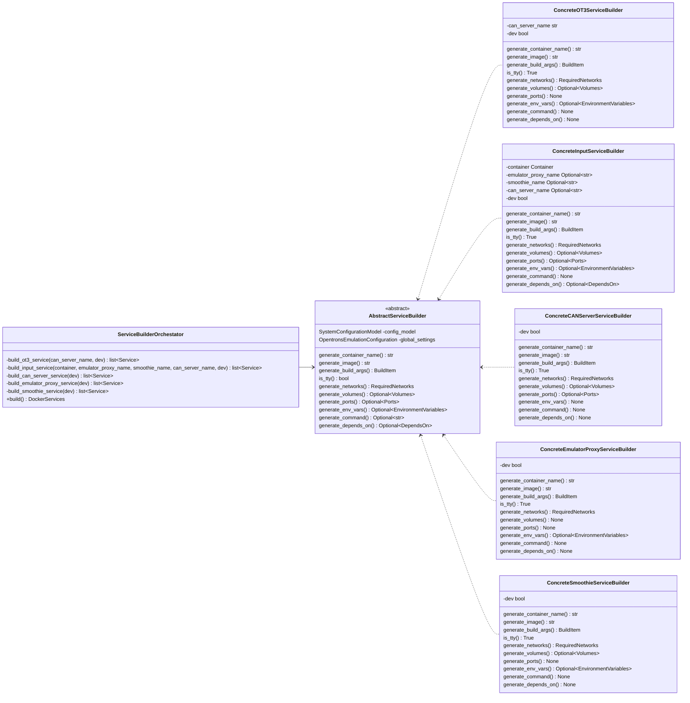

```mermaid
classDiagram
direction LR
class AbstractServiceBuilder
<<abstract>> AbstractServiceBuilder

AbstractServiceBuilder: SystemConfigurationModel -config_model
AbstractServiceBuilder: OpentronsEmulationConfiguration -global_settings 

AbstractServiceBuilder: generate_container_name() str
AbstractServiceBuilder: generate_image() str
AbstractServiceBuilder: generate_build_args() BuildItem
AbstractServiceBuilder: is_tty() bool
AbstractServiceBuilder: generate_networks() RequiredNetworks
AbstractServiceBuilder: generate_volumes() Optional~Volumes~
AbstractServiceBuilder: generate_ports() Optional~Ports~
AbstractServiceBuilder: generate_env_vars() Optional~EnvironmentVariables~
AbstractServiceBuilder: generate_command() Optional~str~
AbstractServiceBuilder: generate_depends_on() Optional~DependsOn~


class ConcreteOT3ServiceBuilder

ConcreteOT3ServiceBuilder: -can_server_name str
ConcreteOT3ServiceBuilder: -dev bool

ConcreteOT3ServiceBuilder: generate_container_name() str
ConcreteOT3ServiceBuilder: generate_image() str
ConcreteOT3ServiceBuilder: generate_build_args() BuildItem
ConcreteOT3ServiceBuilder: is_tty() True
ConcreteOT3ServiceBuilder: generate_networks() RequiredNetworks
ConcreteOT3ServiceBuilder: generate_volumes() Optional~Volumes~
ConcreteOT3ServiceBuilder: generate_ports() None
ConcreteOT3ServiceBuilder: generate_env_vars() Optional~EnvironmentVariables~
ConcreteOT3ServiceBuilder: generate_command() None
ConcreteOT3ServiceBuilder: generate_depends_on() None


class ConcreteInputServiceBuilder

ConcreteInputServiceBuilder: -container Container
ConcreteInputServiceBuilder: -emulator_proxy_name Optional~str~
ConcreteInputServiceBuilder: -smoothie_name Optional~str~
ConcreteInputServiceBuilder: -can_server_name Optional~str~
ConcreteInputServiceBuilder: -dev bool

ConcreteInputServiceBuilder: generate_container_name() str
ConcreteInputServiceBuilder: generate_image() str
ConcreteInputServiceBuilder: generate_build_args() BuildItem
ConcreteInputServiceBuilder: is_tty() True
ConcreteInputServiceBuilder: generate_networks() RequiredNetworks
ConcreteInputServiceBuilder: generate_volumes() Optional~Volumes~
ConcreteInputServiceBuilder: generate_ports() Optional~Ports~
ConcreteInputServiceBuilder: generate_env_vars() Optional~EnvironmentVariables~
ConcreteInputServiceBuilder: generate_command() None
ConcreteInputServiceBuilder: generate_depends_on() Optional~DependsOn~


class ConcreteCANServerServiceBuilder

ConcreteCANServerServiceBuilder: -dev bool

ConcreteCANServerServiceBuilder: generate_container_name() str
ConcreteCANServerServiceBuilder: generate_image() str
ConcreteCANServerServiceBuilder: generate_build_args() BuildItem
ConcreteCANServerServiceBuilder: is_tty() True
ConcreteCANServerServiceBuilder: generate_networks() RequiredNetworks
ConcreteCANServerServiceBuilder: generate_volumes() Optional~Volumes~
ConcreteCANServerServiceBuilder: generate_ports() Optional~Ports~
ConcreteCANServerServiceBuilder: generate_env_vars() None
ConcreteCANServerServiceBuilder: generate_command() None
ConcreteCANServerServiceBuilder: generate_depends_on() None


class ConcreteEmulatorProxyServiceBuilder

ConcreteEmulatorProxyServiceBuilder: -dev bool

ConcreteEmulatorProxyServiceBuilder: generate_container_name() str
ConcreteEmulatorProxyServiceBuilder: generate_image() str
ConcreteEmulatorProxyServiceBuilder: generate_build_args() BuildItem
ConcreteEmulatorProxyServiceBuilder: is_tty() True
ConcreteEmulatorProxyServiceBuilder: generate_networks() RequiredNetworks
ConcreteEmulatorProxyServiceBuilder: generate_volumes() None
ConcreteEmulatorProxyServiceBuilder: generate_ports() None
ConcreteEmulatorProxyServiceBuilder: generate_env_vars() Optional~EnvironmentVariables~
ConcreteEmulatorProxyServiceBuilder: generate_command() None
ConcreteEmulatorProxyServiceBuilder: generate_depends_on() None


class ConcreteSmoothieServiceBuilder

ConcreteSmoothieServiceBuilder: -dev bool

ConcreteSmoothieServiceBuilder: generate_container_name() str
ConcreteSmoothieServiceBuilder: generate_image() str
ConcreteSmoothieServiceBuilder: generate_build_args() BuildItem
ConcreteSmoothieServiceBuilder: is_tty() True
ConcreteSmoothieServiceBuilder: generate_networks() RequiredNetworks
ConcreteSmoothieServiceBuilder: generate_volumes() Optional~Volumes~
ConcreteSmoothieServiceBuilder: generate_ports() None
ConcreteSmoothieServiceBuilder: generate_env_vars() Optional~EnvironmentVariables~
ConcreteSmoothieServiceBuilder: generate_command() None
ConcreteSmoothieServiceBuilder: generate_depends_on() None

class ServiceBuilderOrchestator

ServiceBuilderOrchestator: -build_ot3_service(can_server_name, dev) list~Service~
ServiceBuilderOrchestator: -build_input_service(container, emulator_proxy_name, smoothie_name, can_server_name, dev) list~Service~
ServiceBuilderOrchestator: -build_can_server_service(dev) list~Service~
ServiceBuilderOrchestator: -build_emulator_proxy_service(dev) list~Service~
ServiceBuilderOrchestator: -build_smoothie_service(dev) list~Service~
ServiceBuilderOrchestator: +build() DockerServices


AbstractServiceBuilder <.. ConcreteOT3ServiceBuilder
AbstractServiceBuilder <.. ConcreteInputServiceBuilder
AbstractServiceBuilder <.. ConcreteCANServerServiceBuilder
AbstractServiceBuilder <.. ConcreteEmulatorProxyServiceBuilder
AbstractServiceBuilder <.. ConcreteSmoothieServiceBuilder
ServiceBuilderOrchestator --> AbstractServiceBuilder
```
