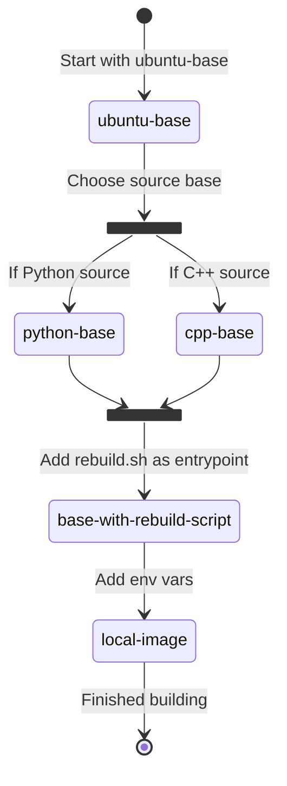
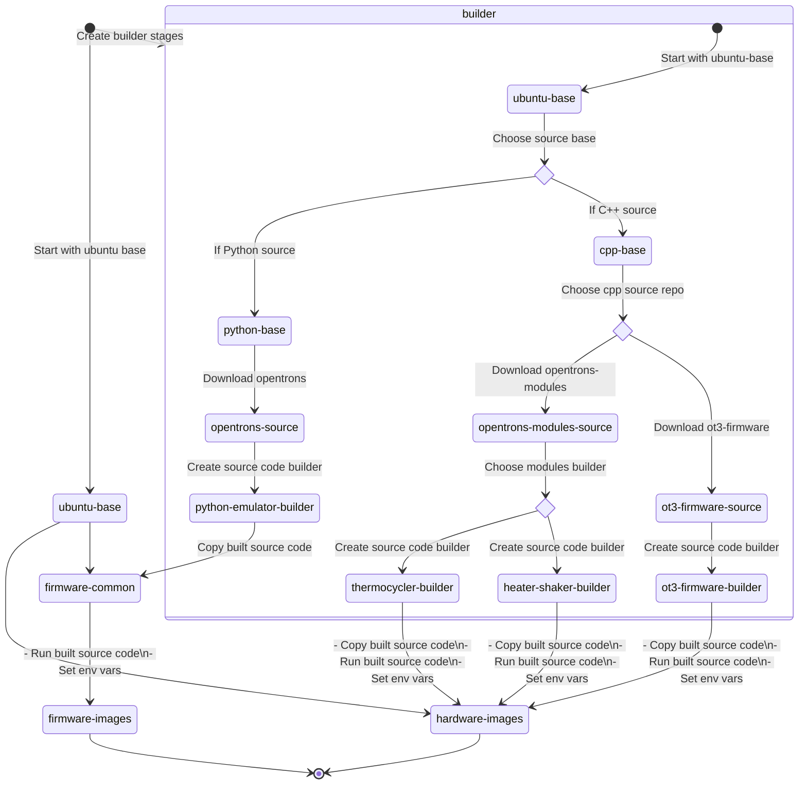

# Dockerfile Architecture

The Dockerfile for `opentrons-emulation` is built with many stages to promote reusing shared resources and to maximize
cache usage when rebuilding images.

The final images can be 1 of 4 types:

- `hardware-local`
- `firmware-local`
- `hardware-remote`
- `firmware-remote`

### ubuntu-base

`ubuntu-base`, the lowest level image for `opentrons-emulation`, is based off of Ubuntu 20.04 and contains dependencies
required by all all images.

### cpp-base

`cpp-base` is built on top of `ubuntu-base` and contains dependencies for building our C++ firmware
inside [ot3-firmware](https://github.com/Opentrons/ot3-firmware) and
[opentrons-modules](https://github.com/Opentrons/opentrons-modules)

### python-base

`python-base` is build on top of `ubuntu-base` and contains dependencies for building our
[python monorepo](https://github.com/Opentrons/opentrons)

## Local Image Creation

## Remote Image Creation

