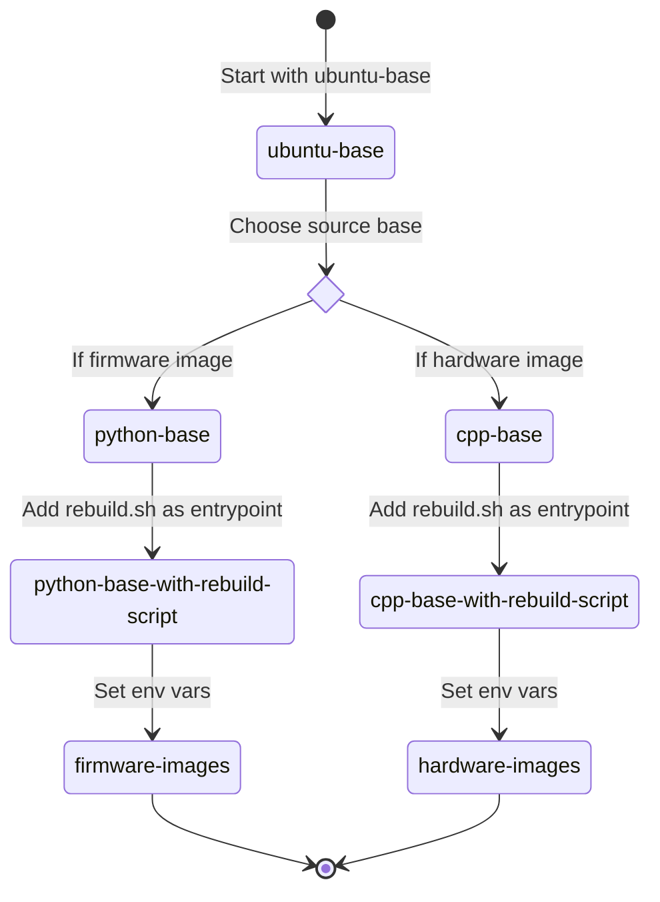

# Dockerfile Architecture

The Dockerfile for `opentrons-emulation` is built with many stages to promote reusing shared resources and to maximize
cache usage when rebuilding images.

The final images can be 1 of 4 types:

- `hardware-local`
- `firmware-local`
- `hardware-remote`
- `firmware-remote`

`hardware` images emulate the physical hardware are based off of c++ firmware code

`firmware` images emulated the firmware and are based off of Python driver code

`local` images expect source code to be bound into the container at the Docker runtime

`remote` images download, build, and run source code at the Docker build time

## Local Image Creation Diagram

## Remote Image Creation Diagram

