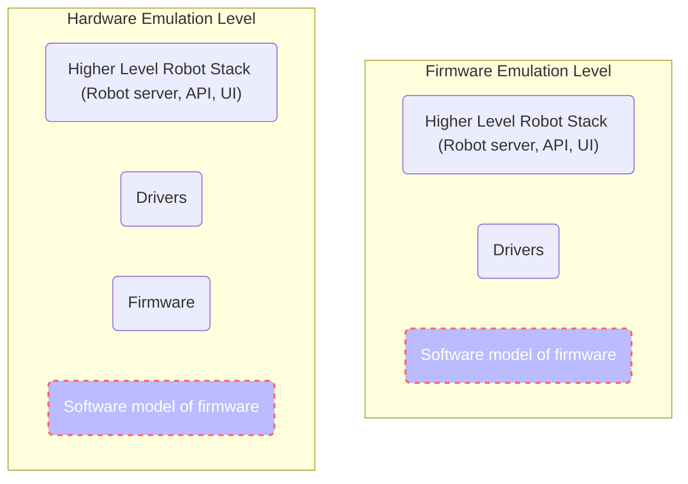

## Emulation Configuration File Key Definitions

The following definitions are available for usage in the emulation configuration file.
`Configuration File Alias` is the value that needs to be put in the configuration file

### id

**Description:** A string value for the name of the emulator.

**Acceptable Values:** Can consist of alphanumeric characters and dashes.

**Examples:** `a-name-for-a-container` `s0me-other-name`

### system-unique-id

**Description:** A string value that will be prefixed to all emulator and network names. Use this to differentiate
systems with the same configuration.

**Acceptable Values:** Can consist of alphanumeric characters and dashes.

**Example:**

You are testing 2 different versions of Heater-Shaker firmware. So you want 2 systems, each with an OT2 and a
Heater-Shaker, with ids `otie` and `twitchy` respectively. The first system can have a `system-unique-id` of
`system-1` and the second system can be `system-2`. The ids of system 1 will be `system-1-otie` and `system-1-twitchy`.
The ids of system 2 will be `system-2-otie` and `system-2-twitchy`.

Because of the `system-unique-id` the emulator names do not clash.

### hardware

**Description:** A string value specifying which hardware to create.

**Acceptable Values:** `ot2`, `ot3`, `heater-shaker-module`, `thermocycler-module`, `temperature-module`,
`magnetic-module`

### source-type

**Description:** A string value specifying where to pull source code from to build the emulator. You can either pull
committed code from Github, or bind in your own local code.

**Acceptable Values:** `remote` `local`

### source-location

**Description:** A string value specifying where the system should look for the source code based on the `source-type`.

If you are using `remote` type, you can either specify `latest` to pull the latest committed version from the master
branch, or specify a full commit sha to pull.

If you are using `local` type, specify a path to the source on your system.

When creating an `ot2` type robot this setting determines what source code the `smoothie` emulator will use. The
`opentrons` repo should be specified.

When creating an `ot2` type robot this setting determines what source code the `ot3-firmware` emulators will use. The
`ot3-firmware` should be specified.

### robot-server-source-type

**Description:** Same as `source-type` but specifies what the robot server will be using for source.

**Acceptable Values:** `remote` `local`

### robot-server-source-location

**Description:** Same as `source-location` but specifies what the system should look for source code for the
robot-server

If you are using `remote` type, you can either specify `latest` to pull the latest committed version from the master
branch, or specify a full commit sha to pull.

If you are using `local` type, specify a path to the source on your system.

Any commit IDs or local bindings should be to the [monorepo](https://github.com/Opentrons/opentrons)

### can-server-source-type

**Description:** Same as `source-type` but specifies what the can server will be using for source.

**Acceptable Values:** `remote` `local`

### can-server-source-location

**Description:** Same as `source-location` but specifies what the system should look for source code for the can-server

If you are using `remote` type, you can either specify `latest` to pull the latest committed version from the master
branch, or specify a full commit sha to pull.

If you are using `local` type, specify a path to the source on your system.

Any commit IDs or local bindings should be to the [monorepo](https://github.com/Opentrons/opentrons)

### emulation-level

**Description:** A string value specifiying which emulation level should be used.

**Acceptable Values:** `firmware` `hardware`



**Supported Emulation Levels By Hardware:**

The various emulators in this repository support different levels of emulation based on their architecture. Below is a
table with the supported levels for each emulator.

| Hardware                 | Firmware Emulation | Hardware Emulation         |
| ------------------------ | ------------------ | -------------------------- |
| **OT2**                  | Yes                | No                         |
| **OT3**                  | No                 | Yes                        |
| **Heater-Shaker Module** | No                 | Yes                        |
| **Thermocycler Module**  | Yes                | Yes (Thermocycler Refresh) |
| **Magnetic Module**      | Yes                | No                         |
| **Temperature Module**   | Yes                | No                         |

### exposed-port

**Description:** An integer value specifying a port to expose to the host system. This is currently only available for
ot2 and ot3 hardware.

**Acceptable Values:** Any free port number

### hardware-specific-attributes

**Description:** An object containing any specific configuration values for hardware you are using.

**Acceptable Values:** Varies. Breakdown below.

#### Pipettes

For OT2 and OT3 you can configure the pipettes attached to the emulated robot.

Example: An OT2 with a P1000 Single and P300 Multi

```json
{
    "system-unique-id": "ot2-only",
    "robot": {
        "id": "otie",
        "hardware": "ot2",
        "source-type": "remote",
        "source-location": "latest",
        "emulation-level": "firmware",
        "exposed-port": 31950,
        "hardware-specific-attributes": {
            "left-pipette": {
                "model": "p1000_single_v2.2",
                "id": "somerandomid"
            },
            "right-pipette": {
                "model": "p300_multi_v2.1",
                "id": "someotherrandomid"
            }
        }
    }
}
```

______________________________________________________________________

##### Available Pipette Models:

**Version 1 Pipette Models**

**P10 Single V1:**
`p10_single_v1` `p10_single_v1.3` `p10_single_v1.4` `p10_single_v1.5`

**P10 Multi V1:**
`p10_multi_v1` `p10_multi_v1.3` `p10_multi_v1.4` `p10_multi_v1.5` `p10_multi_v1.6`

**P50 Single V1:**
`p50_single_v1` `p50_single_v1.3` `p50_single_v1.4` `p50_single_v1.5`

**P50 Single V1:**
`p50_multi_v1` `p50_multi_v1.3` `p50_multi_v1.4` `p50_multi_v1.5`

**P300 Single V1:**
`p300_single_v1` `p300_single_v1.3` `p300_single_v1.4` `p300_single_v1.5`

**P300 Multi V1:**
`p300_multi_v1` `p300_multi_v1.3` `p300_multi_v1.4` `p300_multi_v1.5`

______________________________________________________________________

**Version 2 Pipette Models**

**P20 Single V2:**
`p20_single_v2.0` `p20_single_v2.1` `p20_single_v2.2`

**P20 Single V2:**
`p20_multi_v2.0` `p20_multi_v2.1`

**P300 Single V2:**
`p300_single_v2.0` `p300_single_v2.1`

**P300 Multi V2:**
`p300_multi_v2.0` `p300_multi_v2.1`

**P1000 Single V1:**
`p1000_single_v1` `p1000_single_v1.3` `p1000_single_v1.4` `p1000_single_v1.5`

**P1000 Single V2:**
`p1000_single_v2.0` `p1000_single_v2.1` `p1000_single_v2.2`

______________________________________________________________________

**Version 3 Pipette Models**

**P1000 Single V3:**
`p20_single_v3.0` `p300_single_v3.0` `p1000_single_v3.0`

______________________________________________________________________

#### Heater-Shaker and Thermocycler Refresh Communication Mode

For Heater-Shaker and Thermocycler Refresh you can specify the communication mode for the firmware. Either socket or
through typing G-Codes through stdin. Stdin mode is really only useful for the lowest level debugging and for debugging
the module by itself with nothing else attached. Therefore, it is defaulted to socket mode.

Example: Heater-Shaker in Stdin mode

```json
{
    "system-unique-id": "heater-shaker-stdin-debug",
    "modules": [
        {
            "id": "shakey-and-warm",
            "hardware": "heater-shaker-module",
            "source-type": "remote",
            "source-location": "latest",
            "emulation_level": "hardware",
            "hardware-specific-attributes": {
                "mode": "stdin"
            }
        }
    ]
}
```

#### Temperature Model for Thermocycler and Temperature Modules

For the Thermocycler and Temperature modules you can specify the starting temperature and temperature ramp rate
(degrees-per-tick).

Example 1: Thermocycler Module with custom temperature model

```json
{
    "system-unique-id": "thermocycler-with-custom-temperature-model",
    "modules": [
        {
            "id": "t00-hot-to-handle",
            "hardware": "thermocycler-module",
            "source-type": "remote",
            "source-location": "latest",
            "emulation_level": "firmware",
            "hardware-specific-attributes": {
                "lid-temperature": {
                    "starting": 27.0,
                    "degrees-per-tick": 2.3
                },
                "plate-temperature": {
                    "starting": 23.0,
                    "degrees-per-tick": 3.2
                }
            }
        }
    ]
}
```

Example 2: Temperature Module with custom temperature model

```json
{
    "system-unique-id": "temperature-module-with-custom-temperature-model",
    "modules": [
        {
            "id": "temperamental",
            "hardware": "temperature-module",
            "source-type": "remote",
            "source-location": "latest",
            "emulation_level": "firmware",
            "hardware-specific-attributes": {
                "temperature": {
                    "starting": 27.0,
                    "degrees-per-tick": 2.3
                }
            }
        }
    ]
}
```
