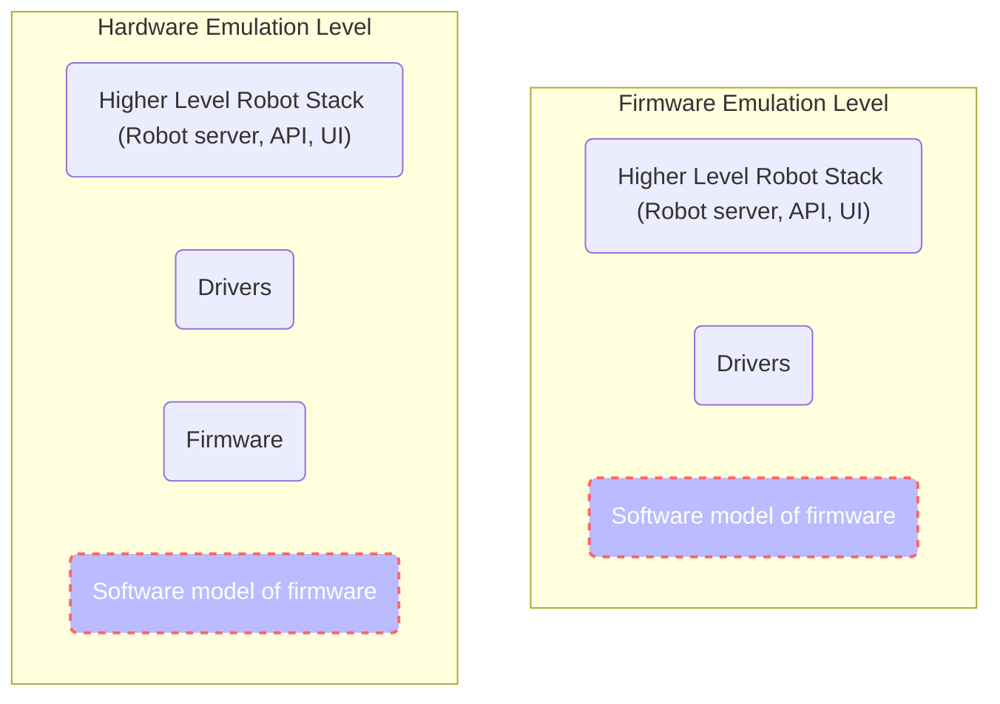

# Emulation Configuration File Key Definitions

The following paramteters are available for usage in the emulation configuration file.

- [Emulation Configuration File Key Definitions](#emulation-configuration-file-key-definitions)
  - [Universal Parameters](#universal-parameters)
    - [ID](#id)
    - [System Unique ID](#system-unique-id)
    - [Hardware](#hardware)
    - [Source Type](#source-type)
    - [Source Location](#source-location)
    - [Emulation level](#emulation-level)
  - [Robot Specific Parameters (OT2 and OT3)](#robot-specific-parameters--ot2-and-ot3-)
    - [Robot Server Source Type](#robot-server-source-type)
    - [Robot Server Source Location](#robot-server-source-location)
    - [Expose Port](#expose-port)
  - [OT3 Specific Parameters](#ot3-specific-parameters)
    - [CAN Server Source Type](#can-server-source-type)
    - [CAN Server Source Location](#can-server-source-location)
  - [Hardware Specific Attributes](#hardware-specific-attributes)
    - [Pipettes](#pipettes)
      - [Available Pipette Models:](#available-pipette-models-)
    - [Temperature Model for Thermocycler and Temperature Modules](#temperature-model-for-thermocycler-and-temperature-modules)
  - [Specifying Custom Environment Variables](#specifying-custom-environment-variables)

## Universal Parameters

### ID

**Parameter Value:** `id`

**Description:** A string value for the name of the emulator.

**Acceptable Values:** Can consist of alphanumeric characters and dashes.

### System Unique ID

**Parameter Value:** `system-unique-id`

**Description:** A string value that will be prefixed to all emulator and network names. Use this to differentiate from
other systems

**Acceptable Values:** Can consist of alphanumeric characters and dashes.

### Hardware

**Parameter Value:** `hardware`

**Description:** A string value specifying which hardware to create.

**Acceptable Values:** `ot2`, `ot3`, `heater-shaker-module`, `thermocycler-module`, `temperature-module`,
`magnetic-module`

### Source Type

**Parameter Value:** `source-type`

**Description:** A string value specifying where to pull source code from to build the emulator. You can either pull
committed code from Github, or bind in your own local code.

**Acceptable Values:** `remote` `local`

### Source Location

**Parameter Value:** `source-location`

**Description:** A string value specifying where the system should look for the source code based on the `source-type`.

If you are using `remote` type, you can either specify `latest` to pull the latest committed version from the master
branch, or specify a full commit sha to pull.

If you are using `local` type, specify a path to the source on your system.

When creating an `ot2` type robot this setting determines what source code the `smoothie` emulator will use. The
`opentrons` repo should be specified.

When creating an `ot2` type robot this setting determines what source code the `ot3-firmware` emulators will use. The
`ot3-firmware` should be specified.

### Emulation level

**Parameter Value:** `emulation-level`

**Description:** A string value specifiying which emulation level should be used.

**Acceptable Values:** `firmware` `hardware`



**Supported Emulation Levels By Hardware:**

The various emulators in this repository support different levels of emulation based on their architecture. Below is a
table with the supported levels for each emulator.

| Hardware                 | Firmware Emulation | Hardware Emulation         |
| ------------------------ | ------------------ | -------------------------- |
| **OT2**                  | Yes                | No                         |
| **OT3**                  | No                 | Yes                        |
| **Heater-Shaker Module** | Yes                | Yes                        |
| **Thermocycler Module**  | Yes                | Yes (Thermocycler Refresh) |
| **Magnetic Module**      | Yes                | No                         |
| **Temperature Module**   | Yes                | No                         |

## Robot Specific Parameters (OT2 and OT3)

### Robot Server Source Type

**Parameter Value:** `robot-server-source-type`

**Description:** Same as `source-type` but specifies what the robot server will be using for source.

**Acceptable Values:** `remote` `local`

### Robot Server Source Location

**Parameter Value:** `robot-server-source-location`

**Description:** Same as `source-location` but specifies what the system should look for source code for the
robot-server

If you are using `remote` type, you can either specify `latest` to pull the latest committed version from the master
branch, or specify a full commit sha to pull.

If you are using `local` type, specify a path to the source on your system.

Any commit IDs or local bindings should be to the [monorepo](https://github.com/Opentrons/opentrons)

### Expose Port

**Parameter Value:** `exposed-port`

**Description:** An integer value specifying a port to expose to the host system. This is currently only available for
ot2 and ot3 hardware.

**Acceptable Values:** Any free port number

## OT3 Specific Parameters

### CAN Server Source Type

**Parameter Value:** `can-server-source-type`

**Description:** Same as `source-type` but specifies what the can server will be using for source.

**Acceptable Values:** `remote` `local`

### CAN Server Source Location

**Parameter Value:** `can-server-source-location`

**Description:** Same as `source-location` but specifies what the system should look for source code for the can-server

If you are using `remote` type, you can either specify `latest` to pull the latest committed version from the master
branch, or specify a full commit sha to pull.

If you are using `local` type, specify a path to the source on your system.

Any commit IDs or local bindings should be to the [monorepo](https://github.com/Opentrons/opentrons)

## Hardware Specific Attributes

**Parameter Value:** `hardware-specific-attributes`

**Description:** An object containing any specific configuration values for hardware you are using.

**Acceptable Values:** Varies. Breakdown below.

### Pipettes

For OT2 and OT3 you can configure the pipettes attached to the emulated robot.

Example: An OT2 with a P1000 Single and P300 Multi

```yaml
system-unique-id: ot2-only
robot:
  id: otie
  hardware: ot2
  source-type: remote
  source-location: latest
  robot-server-source-type: remote
  robot-server-source-location: latest
  emulation-level: firmware
  exposed-port: 31950
  hardware-specific-attributes:
    left-pipette:
      model: p1000_single_v2.2
      id: somerandomid
    right-pipette:
      model: p300_multi_v2.1
      id: someotherrandomid
```

______________________________________________________________________

#### Available Pipette Models:

**Version 1 Pipette Models**

**P10 Single V1:**
`p10_single_v1` `p10_single_v1.3` `p10_single_v1.4` `p10_single_v1.5`

**P10 Multi V1:**
`p10_multi_v1` `p10_multi_v1.3` `p10_multi_v1.4` `p10_multi_v1.5` `p10_multi_v1.6`

**P50 Single V1:**
`p50_single_v1` `p50_single_v1.3` `p50_single_v1.4` `p50_single_v1.5`

**P50 Single V1:**
`p50_multi_v1` `p50_multi_v1.3` `p50_multi_v1.4` `p50_multi_v1.5`

**P300 Single V1:**
`p300_single_v1` `p300_single_v1.3` `p300_single_v1.4` `p300_single_v1.5`

**P300 Multi V1:**
`p300_multi_v1` `p300_multi_v1.3` `p300_multi_v1.4` `p300_multi_v1.5`

______________________________________________________________________

**Version 2 Pipette Models**

**P20 Single V2:**
`p20_single_v2.0` `p20_single_v2.1` `p20_single_v2.2`

**P20 Single V2:**
`p20_multi_v2.0` `p20_multi_v2.1`

**P300 Single V2:**
`p300_single_v2.0` `p300_single_v2.1`

**P300 Multi V2:**
`p300_multi_v2.0` `p300_multi_v2.1`

**P1000 Single V1:**
`p1000_single_v1` `p1000_single_v1.3` `p1000_single_v1.4` `p1000_single_v1.5`

**P1000 Single V2:**
`p1000_single_v2.0` `p1000_single_v2.1` `p1000_single_v2.2`

______________________________________________________________________

**Version 3 Pipette Models**

**P1000 Single V3:**
`p20_single_v3.0` `p300_single_v3.0` `p1000_single_v3.0`

______________________________________________________________________

### Temperature Model for Thermocycler and Temperature Modules

For the Thermocycler and Temperature modules you can specify the starting temperature and temperature ramp rate
(degrees-per-tick).

Example 1: Thermocycler Module with custom temperature model

```yaml
system-unique-id: ot2-only
robot:
  id: otie
  hardware: ot2
  source-type: remote
  source-location: latest
  robot-server-source-type: remote
  robot-server-source-location: latest
  emulation-level: firmware
  exposed-port: 31950
modules:
  - id: t00-hot-to-handle
    hardware: thermocycler-module
    source-type: remote
    source-location: latest
    emulation_level: firmware
    hardware-specific-attributes:
      lid-temperature:
        starting: 27
        degrees-per-tick: 2.3
      plate-temperature:
        starting: 23
        degrees-per-tick: 3.2
```

Example 2: Temperature Module with custom temperature model

```yaml
system-unique-id: ot2-only
robot:
  id: otie
  hardware: ot2
  source-type: remote
  source-location: latest
  robot-server-source-type: remote
  robot-server-source-location: latest
  emulation-level: firmware
  exposed-port: 31950
modules:
  - id: temperamental
    hardware: temperature-module
    source-type: remote
    source-location: latest
    emulation_level: firmware
    hardware-specific-attributes:
      temperature:
        starting: 27
        degrees-per-tick: 2.3
```

## Specifying Custom Environment Variables

All containers can accept custom environment variable designations through the configuration file.
Each env variable is equivalant to running `export <env_var_name>=<env_var_value>`.

For example, the following yaml:

```yaml
robot-server-env-vars:
  ROBOT_NICKNAME: "otie"
  DATADOG_PATH: "/home/datadog/"
```

is equivalant to opening a shell in the `robot-server` and running

```shell
export ROBOT_NICKNAME="otie"
export DATADOG_PATH="/home/datadog/"
```

**FIELD BREAKDOWN**

| Container Name       | Variable Name           | Block to Add to | Required Hardware Value |
| -------------------- | ----------------------- | --------------- | ----------------------- |
| robot-server         | robot-server-env-vars   | `robot`         | `ot2` `ot3`             |
| emulator-proxy       | emulator-proxy-env-vars | `robot`         | `ot2` `ot3`             |
| smoothie             | smoothie-env-vars       | `robot`         | `ot2`                   |
| ot3-pipettes         | pipettes-env-vars       | `robot`         | `ot3`                   |
| ot3-gripper          | gripper-env-vars        | `robot`         | `ot3`                   |
| ot3-head             | head-env-vars           | `robot`         | `ot3`                   |
| ot3-gantry-x         | gantry-x-env-vars       | `robot`         | `ot3`                   |
| ot3-gantry-y         | gantry-y-env-vars       | `robot`         | `ot3`                   |
| ot3-bootloader       | bootloader-env-vars     | `robot`         | `ot3`                   |
| ot3-can-server       | can-server-env-vars     | `robot`         | `ot3`                   |
| heater-shaker-module | module-env-vars         | `modules`       | `heater-shaker-module`  |
| temperature-module   | module-env-vars         | `modules`       | `temperature-module`    |
| thermocycler-module  | module-env-vars         | `modules`       | `thermocycler-module`   |
| temperature-module   | module-env-vars         | `modules`       | `temperature-module`    |

```yaml
# OT-2 Example

robot:
  id: otie
  hardware: ot2
  source-type: remote
  source-location: latest
  emulation-level: firmware
  robot-server-source-type: remote
  robot-server-source-location: latest
  exposed-port: 31950
  smoothie-env-vars:
    smoothie_1: "tester"
    smoothie_2: 3.0
    smoothie_3: 5
  robot-server-env-vars:
    ot2_1: "ot2"
    ot2_2: 5.0
    ot2_3: 6
modules:
  - id: shakey-and-warm
    hardware: heater-shaker-module
    source-type: remote
    source-location: latest
    emulation_level: hardware
    module-env-vars:
      hs_1: "hs"
      hs_2: 1
      hs_3: 1.1
  - id: t00-hot-to-handle
    hardware: thermocycler-module
    source-type: remote
    source-location: latest
    emulation_level: firmware
    module-env-vars:
      thermocycler_1: "thermocycler"
      thermocycler_2: 2
      thermocycler_3: 2.2
  - id: fatal-attraction
    hardware: magnetic-module
    source-type: remote
    source-location: latest
    emulation_level: firmware
    module-env-vars:
      magnetic_1: "magnetic"
      magnetic_2: 3
      magnetic_3: 3.3
  - id: temperamental
    hardware: temperature-module
    source-type: remote
    source-location: latest
    emulation_level: firmware
    module-env-vars:
      temperature_1: "temperature"
      temperature_2: 4
      temperature_3: 4.4
```

```yaml
# OT-3 Example

robot:
  id: otie
  hardware: ot3
  source-type: remote
  source-location: latest
  robot-server-source-type: remote
  robot-server-source-location: latest
  can-server-source-type: remote
  can-server-source-location: latest
  opentrons-hardware-source-type: remote
  opentrons-hardware-source-location: latest
  emulation-level: hardware
  exposed-port: 31950
  can-server-exposed-port: 9898
  robot-server-env-vars:
    ot3_1: "ot3"
    ot3_2: 6
    ot3_3: 7.542564
  can-server-env-vars:
    test_1: 1
    test_2: "test 2"
    test_3: 3.3
  emulator-proxy-env-vars:
    emulator_proxy_1: 2
    emulator_proxy_2: "A test"
    emulator_proxy_3: 5.5
  gripper-env-vars:
    gripper_1: 3
    gripper_2: "gripper"
    gripper_3: 7.7
  head-env-vars:
    head_1: 4
    head_2: "head"
    head_3: 1.1
  gantry-x-env-vars:
    gantry_x_1: 5
    gantry_x_2: "gantry x"
    gantry_x_3: 4.4
  gantry-y-env-vars:
    gantry_y_1: 6
    gantry_y_2: "gantry y"
    gantry_y_3: 4.23
  bootloader-env-vars:
    bootloader_1: 7
    bootloader_2: "bootloader"
    bootloader_3: 7.632
  pipettes-env-vars:
    pipettes_1: 8
    pipettes_2: "pipettes"
    pipettes_3: 4.657468
```
